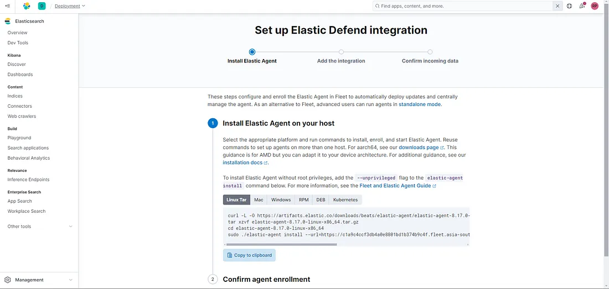
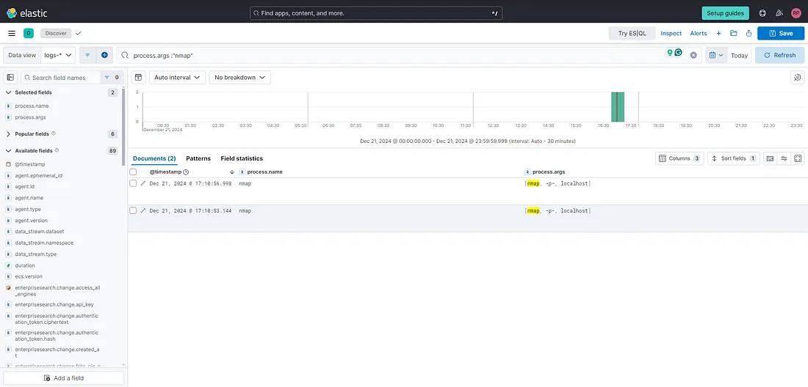
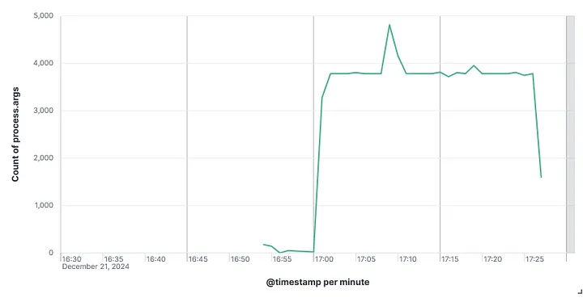
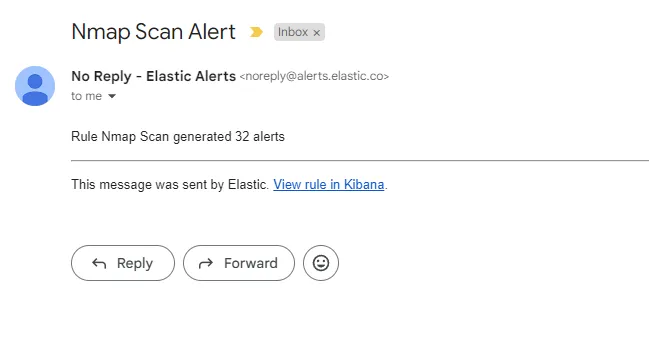

# Elastic Stack-Based SIEM for Log Analysis and Threat Detection

## Objective

This project began as a hands-on way to better understand how SIEMs work in real-world environments. My goal was to set up the Elastic Stack as a SIEM, collect logs and metrics from a Kali Linux VM, and configure email alerts for potential threats. Through this process, I aimed to deepen my cybersecurity knowledge and build practical skills I can apply in real-world scenarios.

  
🔗 **Read the full blog post here:**  
[Elastic Stack-Based SIEM for Log Analysis and Threat Detection](https://medium.com/@rajesh.p3807/configuring-elastic-stack-for-siem-my-journey-with-log-management-and-alerts-48bbcb7c358f)

### Skills Learned

- Advanced understanding of SIEM concepts and practical application.
- Proficiency in analyzing and interpreting network logs.
- Ability to generate and recognize attack signatures and patterns.
- Enhanced knowledge of network protocols and security vulnerabilities.
- Development of critical thinking and problem-solving skills in cybersecurity.

### Tools Used

- Security Information and Event Management (SIEM) system using the Elastic Stack for log ingestion, correlation, and analysis.
- Telemetry shippers (Filebeat and Metricbeat) for collecting system logs and performance metrics from Kali Linux.
- Virtualized Kali Linux environment for generating realistic system activity and security events.
- Alerting frameworks (Kibana Alerting and Elastalert) for real-time threat detection and email notifications.
- Virtualization platform (VirtualBox/VMware) to simulate a controlled test environment.

## Steps
- Install Kali Linux either on your system directly or as a virtual machine using a hypervisor like VirtualBox or VMware.
- Sign up for a free trial on the Elastic Cloud platform to access the Elastic Stack.
- From the Elastic Defend integration page, select your platform (Linux).

- Install the Elastic Agent on the Kali Linux machine to enable log collection and monitoring.
- On the Kali Linux machine, run an Nmap scan targeting localhost to simulate network reconnaissance activity.
- In Kibana, filter the logs using fields such as process.args or @timestamp to identify entries related to the Nmap scan.

- Visualize the filtered logs using a Kibana dashboard to highlight suspicious or abnormal activity.

- Create an alert rule in Kibana that detects Nmap scan patterns and configure it to trigger email notifications for real-time response.

